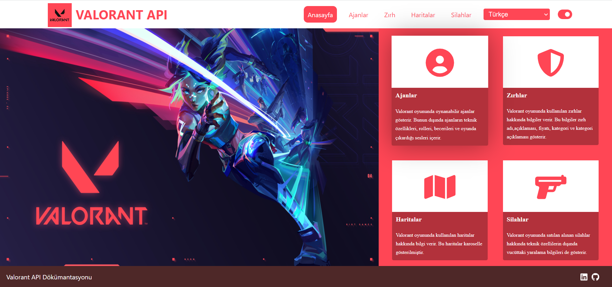
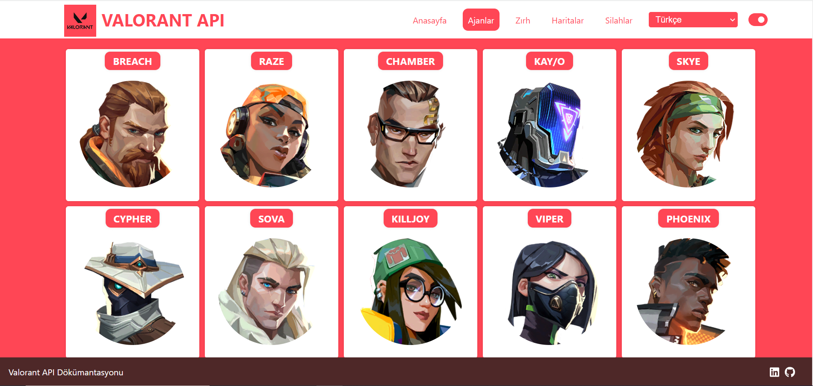
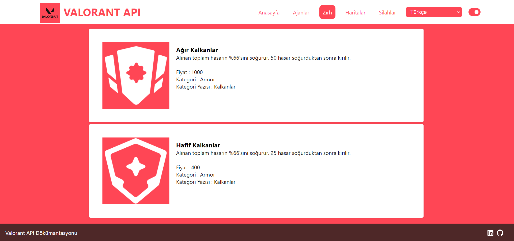
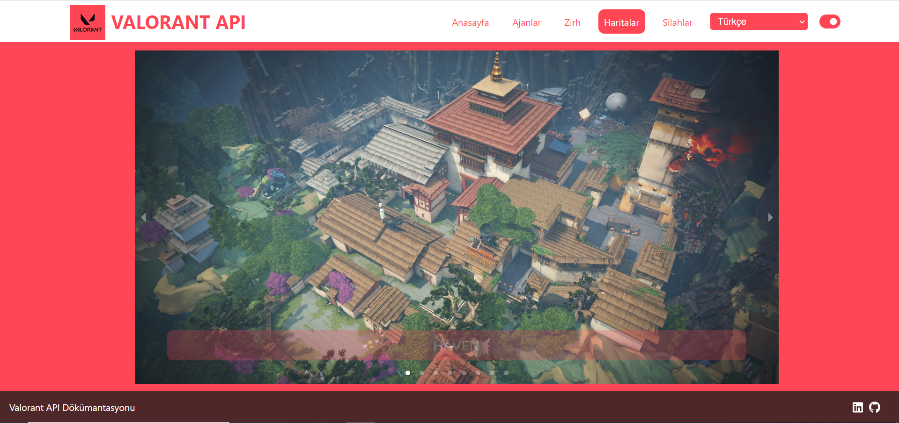
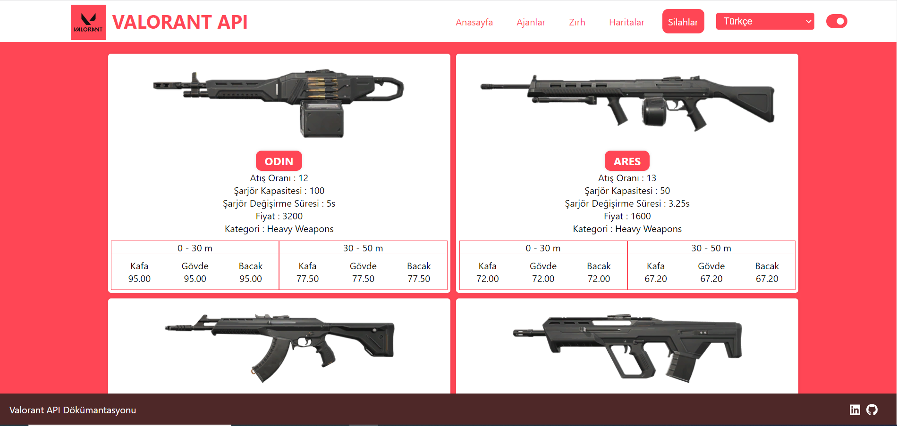
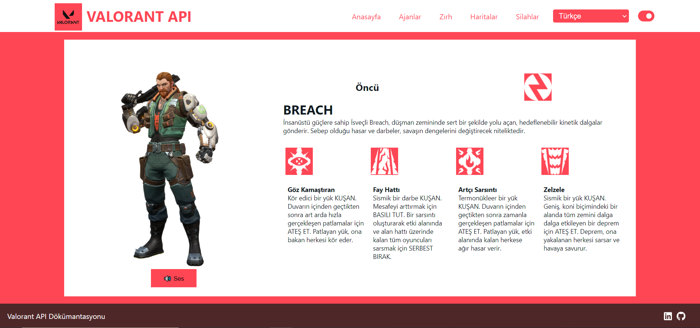
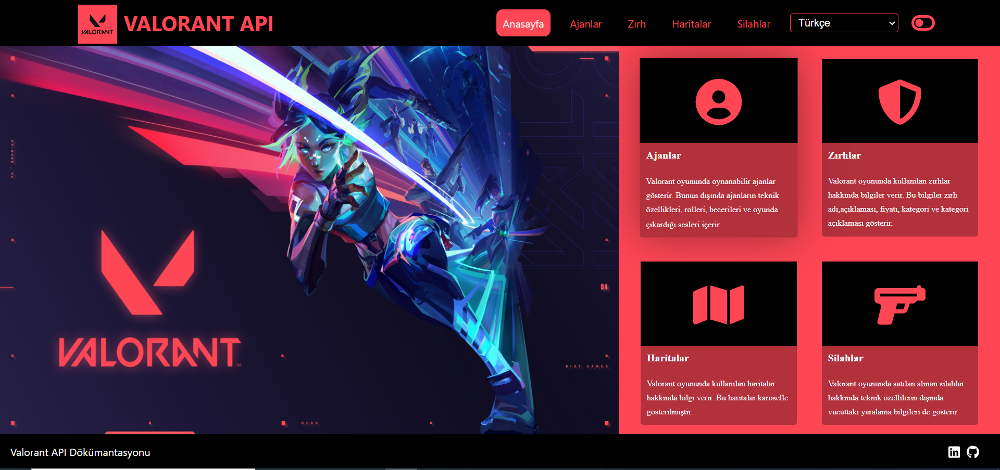

# Valorant API React Project

### 📖 Information

<ul style="list-style-type:disc">
  <li>With the usage of Valorant API from https://valorant-api.com/ , thie project is made of different kinds of information about Valorant Game</li>
  <li>Here is the explanation of the project
      <ul>
        <li>General information about the game in the home page</li>
        <li>General information about agents with their characteristic features</li>
        <li>General information about gears which agents can wear</li>
        <li>General information about maps</li>
        <li>General information about weapons which agents can buy before starting the game</li>
        <li>Adding language feaetures to convert all information to selected language through i18next</li>
        <li>Adding toggle button to change the theme of the webiste (dark mode, light mode) </li>
      </ul>
  </li>
</ul>

### 🔨 Run the App

<b>1 )</b> Download your project from this link `https://github.com/Rapter1990/ValorantApiReactProject`

<b>2 )</b> Go to the project's home directory :  `cd ValorantApiReactProject`

<b>3 )</b> Install all libraries used in the project through this command `npm install`

<b>4 )</b> Run the project though this command `npm start`

### Screenshots

Click here to show the screenshots of project

    
 Figure 1 

    
    
 Figure 2 

    
    
 Figure 3 

    
    
 Figure 4 

    
    
 Figure 5 

    
    
 Figure 6 

    
    
 Figure 7 

    

